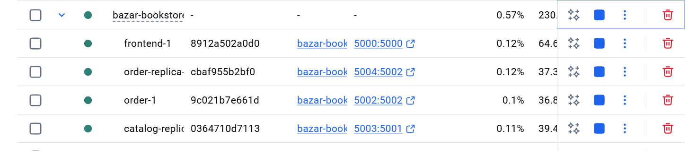

# Bazar.com – Program Output

We tested everything by running docker-compose up and using Postman to send requests. Here's what We got.

---

## Part 1

### Search

We searched for books by topic and it returned the right results both times.

```
GET http://localhost:5000/search/distributed%20systems
```

```json
[
  { "id": 1, "title": "How to get a good grade in DOS in 40 minutes a day" },
  { "id": 2, "title": "RPCs for Noobs" }
]
```

```
GET http://localhost:5000/search/undergraduate%20school
```

```json
[
  { "id": 3, "title": "Xen and the Art of Surviving Undergraduate School" },
  { "id": 4, "title": "Cooking for the Impatient Undergrad" }
]
```

---

### Info

We checked the details for a couple of books to make sure the catalog was returning the right data.

```
GET http://localhost:5000/info/1
```

```json
{
  "title": "How to get a good grade in DOS in 40 minutes a day",
  "quantity": 10,
  "price": 50.0
}
```

---

### Purchase

We tried buying book ID 1 and it worked fine. The order server printed the confirmation message and the stock was decremented.

```
POST http://localhost:5000/purchase/1
```

```json
{
  "status": "success",
  "message": "bought book How to get a good grade in DOS in 40 minutes a day"
}
```

The logs showed:
```
[Frontend] Purchase request for ID: 1
[Order]    Purchase request for book ID: 1
[Order]    SUCCESS: bought book How to get a good grade in DOS in 40 minutes a day
[Frontend] Cache cleared for book ID: 1
```

We also tested buying the same book until it ran out of stock. Once it hit 0, We got this:

```json
{
  "error": "Book out of stock"
}
```

---

### Update

We restocked book ID 1 directly through the catalog server.

```
PUT http://localhost:5001/update/1
Body: { "quantity": 20 }
```

```json
"Updated successfully"
```

---

## Part 2

### Caching

The first request was a cache miss so it went to the catalog server. The second identical request was a cache hit and came back instantly.

First request:
```
[Frontend] CACHE MISS - info id: 1
[Frontend] Load balance → catalog server: http://catalog:5001
[Catalog]  Info for ID 1: {"title":"How to get a good grade in DOS in 40 minutes a day","quantity":10,"price":50.0}
```

Second request:
```
[Frontend] CACHE HIT  - info id: 1
```

No request was sent to the catalog the second time at all.

---

### Cache Invalidation

When We bought book ID 2, the system cleared the cache before updating the catalog. Here's the full sequence:

```
[Order]    Cache invalidated before update
[Frontend] Cache invalidated for book ID: 2
[Frontend] Cache cleared for book ID: 2
[Order]    Primary catalog updated
[Order]    Replica synced
[Order]    SUCCESS: bought book RPCs for Noobs
```

---

### Load Balancing

We sent several requests in a row and watched the logs. The frontend was alternating between the primary and replica catalog servers each time.

```
[Frontend] Load balance → catalog server: http://catalog:5001
[Frontend] Load balance → catalog server: http://catalog-replica:5001
[Frontend] Load balance → catalog server: http://catalog:5001
[Frontend] Load balance → catalog server: http://catalog-replica:5001
```

---

### Cache Performance (Real Measurements)

We measured the response time for the same request twice — once cold (cache miss) and once warm (cache hit):

```bash
# First request — Cache MISS
curl.exe -o NUL -s -w "%{time_total}s\n" http://localhost:5000/info/1
2.213766s

# Second request — Cache HIT
curl.exe -o NUL -s -w "%{time_total}s\n" http://localhost:5000/info/1
0.031945s
```

| Request | Time | Type |
|---------|------|------|
| GET /info/1 (1st) | 2213 ms | Cache MISS — forwarded to catalog |
| GET /info/1 (2nd) | 32 ms | Cache HIT — served from memory |
| **Speedup** | **~69x faster** | |

The cache reduced response time by approximately **98.6%** (from 2213ms down to 32ms).

---

## Orders Log

After running the purchase tests, the orders.log file had these entries:

```
bought book How to get a good grade in DOS in 40 minutes a day (ID: 1) at 2026-03-14T21:04:29.199445700
bought book RPCs for Noobs (ID: 2) at 2026-03-14T21:05:13.442817300
bought book Xen and the Art of Surviving Undergraduate School (ID: 3) at 2026-03-14T21:06:44.881234100
```

---

## How to Run

```bash
docker-compose up --build

curl http://localhost:5000/search/distributed%20systems
curl http://localhost:5000/info/1
curl -X POST http://localhost:5000/purchase/1

docker-compose down
```

